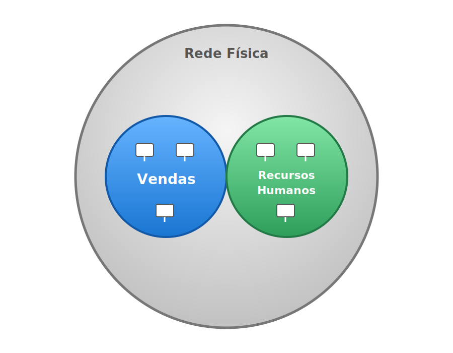

# :material-lan-connect: Redes
## :fontawesome-solid-tags: VLANs

!!!note "Nota"
    Existem vários conceitos referenciados aqui, como: o protocolo IP. Apesar desses princípios trabalharem em conjunto, as VLANs estão situadas na camada 2 do modelo OSI e, por isso, são idenpendentes da camada 3 onde o IP se situa. Dito isto, para entender de fato essas ideias, é importante primeiro conhecer o funcionamento de cada coisa.
  
Segundo a Wikipédia:
> "Uma **rede local virtual (*Virtual Local Area Network*)** é um domínio de broadcast de uma rede local (LAN) que é particionado e isolado em uma rede virtual na camada de enlace de dados (camada 2 do modelo OSI). Uma VLAN se comporta como um switch de rede virtual ou um enlace de rede virtual, podendo compartilhar a mesma infraestrutura física com outras VLANs enquanto permanece logicamente isolada delas."

Quando falamos de VLANs, geralmente temos uma terminologia que pode gerar certa confusão. Na prática, temos as seguintes palavras-chave:

* **Tag:** identificador da VLAN, geralmente dizemos que uma porta do switch tem no mínimo uma tag atrelada.
* **Trunk:** porta de conexão que carrega várias tags. Alguns exemplos de dispositivos que são conectados em portas trunk são switches e pontos de acesso ("*Access Points*" - APs), pois eles costumam propagar as VLANs para outros segmentos da rede.
* **802.1Q:** Padrão IEEE para Redes Locais e Metropolitanas — Pontes (Bridges) e Redes Baseadas em Pontes (Bridged Networks)

Vale destacar que, apesar de existirem padrões bem definidos, é comum haver algumas variações entre diferentes fabricantes e a forma como as VLANs são configuradas, incluindo diferentes terminologias.

### Exemplo
Para ilustrar melhor o conceito, podemos pensar no seguinte cenário: imagine que, dentro de uma empresa, temos uma rede para o departamento de vendas e uma outra para o departamento de Recursos Humanos. No modelo de configuração mais simples, todos os computadores estariam na mesma rede lógica, compartilhando o mesmo domínio de broadcast. Isso significa que todos podem se comunicar diretamente. Neste caso, mesmo pacotes de controle, se propagam de forma irrestrita. Ou seja, se quisermos fazer uma melhor separação entre as redes dos departamentos, a melhor forma é o emprego de redes virtuais locais. Para exemplificar de uma forma mais próxima da realidade, vamos definir algumas informações práticas:

* Rede do departamento de Vendas
    * VLAN: 10
    * Endereço da rede: 192.168.10.0
    * Faixa de IPs: 192.168.10.1 - 192.168.10.254
    * Endereço de broadcast: 192.168.10.255
    * Máscara da rede: /24 (255.255.255.0)
* Rede do departamento de Recursos Humanos:
    * VLAN: 20
    * Endereço da rede: 192.168.20.0
    * Faixa de IPs: 192.168.20.1 - 192.168.20.254
    * Endereço de broadcast: 192.168.20.255
    * Máscara da rede: /24 (255.255.255.0)

Com essa divisão, conseguimos organizar de maneira simples as redes da organização. Para tanto, os dispositivos de rede (gateways, switches e APs) precisariam ser configurados e essa configuração depende da infraestrutura da organização.

O interessante de tudo isso é que, a partir dessa segmentação, podemos criar regras específicas para cada uma das repartições, o que torna mais fácil de gerenciar os perfis de cada um e, o melhor de tudo: não precisamos fazer divisões físicas, um mesmo switch pode fazer essa separação e definir qual porta vai receber qual **tag**.
!!!tip "Analogia"
    Fazendo uma analogia com o mundo real, podemos imaginar que temos uma tubulação larga e que dentro desta tubulação temos canos menores que carregam diferentes tipos de substâncias (água, esgoto e gás, por exemplo), neste caso, teríamos um cano para o departamento de Vendas e outro para o departamento do RH.
    